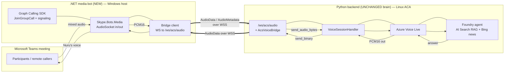

# Teams Meeting Bot — design & architecture (Phase 2b, issue #27)

> **Goal in one sentence:** let the avatar (Nuru) **join a Teams meeting, hear every
> participant — including remote callers — and answer their spoken questions aloud**,
> grounded in the same board‑minutes + news knowledge it already uses.

This document is the **single source of truth** for *why* this part of the system looks the
way it does. It is deliberately detailed because the design is non‑obvious: it mixes a
Python service and a .NET service on purpose, and that decision needs to be defensible.

- [1. The problem, precisely](#1-the-problem-precisely)
- [2. The three options we evaluated](#2-the-three-options-we-evaluated)
- [3. The decision (and why)](#3-the-decision-and-why)
- [4. Final architecture](#4-final-architecture)
- [5. How audio flows (the bridge)](#5-how-audio-flows-the-bridge)
- [6. Identity, permissions & admission](#6-identity-permissions--admission)
- [7. Turn‑taking & barge‑in](#7-turn-taking--barge-in)
- [8. Hosting & infrastructure](#8-hosting--infrastructure)
- [9. Compliance & consent](#9-compliance--consent)
- [10. The two‑step delivery plan](#10-the-two-step-delivery-plan)
- [11. Risks, costs & open questions](#11-risks-costs--open-questions)
- [12. Glossary](#12-glossary)

---

## 1. The problem, precisely

The avatar already answers spoken questions beautifully **on the web** (mic → Azure Voice
Live → Foundry agent with AI Search RAG + Bing news → spoken answer). Phase 2b is **not**
about answering — that pipeline is reused untouched. The hard, new problem is **meeting
media transport**: getting *the room's* audio into that pipeline and the avatar's voice
back into *the room*.

Two facts, **proven live**, shape everything below:

1. **A browser / Teams‑tab client can only hear its own microphone.** This is Teams
   *client isolation* — by design, a web client never receives other participants' audio
   streams. We verified this three independent ways (our own logs showed `wiredTracks=0`,
   `maxRms=0`; the SDK exposes no public remote‑audio track; Microsoft's own guidance
   confirms it). **No setting changes this.** So the shipped browser path can never hear
   a room.

2. **ACS Call Automation server‑side media does not deliver Teams *meeting* audio.** Its
   bidirectional audio streaming works for ACS / PSTN / Teams‑*user* calls, but not for a
   Teams *meeting*. So "use ACS from Python" — attractive because ACS *has* a Python SDK —
   does **not** solve the room‑audio problem either.

Therefore the room's audio can only be obtained **server‑side, through Microsoft's Teams
calling/media platform**, which is the next section.

---

## 2. The three options we evaluated

| Option | How it admits to the meeting | Can it hear the **whole room**? | Language / host | Verdict |
| --- | --- | --- | --- | --- |
| **(a) ACS Call Automation + Teams interop** | ACS service joins via meeting link | **No** — does not carry Teams *meeting* audio (proven) | Python ✅ / Linux ACA ✅ | ❌ Doesn't meet the goal |
| **(b) Graph Real‑Time Media bot** (`Microsoft.Skype.Bots.Media`) | Graph `JoinGroupCall` as an application‑hosted media bot | **Yes** — receives the mixed participant audio | **.NET only / Windows only** | ✅ The only path that hears everyone |
| **(c) Browser / shared‑stage tab** | Embed the web avatar on the meeting stage | **No** — client isolation (proven) | Python/JS ✅ | ⚠️ Great for *presence*, not for *hearing* |

The uncomfortable truth: **the only option that actually hears the room is (b), and (b) is
.NET + Windows‑only.** There is no Python SDK for `Microsoft.Skype.Bots.Media`, and the
media stack must run on a Windows guest OS. This is a genuine platform constraint, not a
preference.

---

## 3. The decision (and why)

> **D‑2b: Keep the Python pipeline as the unchanged "brain", and add one *thin* .NET /
> Windows media‑bot as the meeting's ears and mouth. Do not rewrite the solution to .NET.**

### Why mix languages instead of going all‑.NET

- **Only one component is .NET/Windows‑locked** — the media ingestion. Everything else
  (Voice Live, the Foundry agent, RAG, the Phase 2a bot, the web app, infra) is fully
  supported in Python and already deployed and working.
- **The .NET bot carries no business logic.** It is a *media pump*: join → grab PCM →
  forward → play back. All intelligence (STT, retrieval, answer, TTS, turn‑taking) stays
  in Python, behind a clean, language‑agnostic WebSocket seam that **already exists**
  (`/ws/acs/audio`, see §5).
- **A full .NET rewrite would not even remove the tax.** The real cost here is *Windows
  hosting for the media stack*, not the C#‑vs‑Python choice. Rewriting the whole working
  app to .NET would throw away a deployed system, add large risk, and you would *still*
  need the Windows media host. It buys nothing where it actually hurts.

### What this costs (be honest)

1. **A Windows host** (VM / VMSS / Windows‑node AKS) — the media bot cannot ride the
   existing Linux Azure Container App. This is the biggest operational tax.
2. **One extra network hop** (PCM over the bridge WebSocket) on top of Voice Live's
   first‑token latency. Mitigated by co‑locating the bot in the same region.
3. **A second toolchain** (.NET build + NuGet + a separate container/host + a bicep
   module). Contained, because the bot's scope is small and stable.

The boundary is a deliberate, documented seam — not tangled interop.

---

## 4. Final architecture

**Two services, one clean seam:**

| | .NET media bot (new) | Python backend (existing) |
| --- | --- | --- |
| **Runs on** | Windows host | Linux Azure Container App |
| **Owns** | Meeting join, media sockets, the bridge client | Voice Live, Foundry, RAG, turn‑taking, barge‑in |
| **Knows about answering?** | No — it only moves audio | Yes — all of it |
| **Talks to the other via** | `wss://<app>/ws/acs/audio` (PCM16 `AudioData` frames) | the same WebSocket |

The seam is the **already‑built** `/ws/acs/audio` endpoint and `AcsVoiceBridge`
(`backend/acs/`). It was written for ACS Call Automation's wire format
(`AudioMetadata` then base64‑PCM16 `AudioData` frames). **The .NET bot mimics that exact
wire format**, so the Python side needs little or no change — the bot simply becomes a new
producer/consumer of a protocol the backend already speaks.

---

## 5. How audio flows (the bridge)

The contract on `/ws/acs/audio` (see `backend/acs/bridge.py::AcsVoiceBridge`):

**Inbound — bot → Python (the room speaking):**
1. On connect, send one metadata frame:
   `{"kind":"AudioMetadata","audioMetadata":{"sampleRate":16000,"channels":1,"encoding":"pcm"}}`
2. Then a stream of audio frames (20 ms each):
   `{"kind":"AudioData","audioData":{"data":"<base64 PCM16>","silent":false}}`
   The bridge base64‑decodes and calls `handler.send_audio_bytes(pcm)` → Voice Live.

**Outbound — Python → bot (Nuru answering):**
- Voice Live emits PCM16; `bridge.send_binary` wraps it as
  `{"Kind":"AudioData","AudioData":{"Data":"<base64 PCM16>"}}` and sends it down the same
  socket. The bot decodes and writes it to its outbound `AudioSocket` → into the meeting.
- Barge‑in: when a human starts talking, Voice Live interrupts and the bridge sends
  `{"Kind":"StopAudio"}`; the bot **flushes its outbound audio buffer** immediately so
  Nuru stops mid‑sentence.

**Format:** 16‑bit PCM, mono. Voice Live accepts 16 kHz or 24 kHz; the Graph media platform
delivers 16 kHz mono — so we run the seam at **16 kHz** end‑to‑end and no resampling is
needed. (`ACS_AUDIO_SAMPLE_RATE` already governs this on the Python side.)

> **Design win:** because the protocol, turn‑taking, and barge‑in already live in Python,
> the .NET bot is small and "dumb". All future answer/behavior changes stay in Python.

---

## 6. Identity, permissions & admission

**Reused (already provisioned in the MngEnv tenant):**

- **Entra app `avatar-forge-meeting-bot`** (`860ecee0‑…`). Its four Graph **application**
  permissions are **already admin‑consented** (verified live):
  `Calls.JoinGroupCall.All`, `Calls.JoinGroupCallAsGuest.All`,
  **`Calls.AccessMedia.All`** (this is what unlocks the room's audio), `OnlineMeetings.Read.All`.

**New / still required for Slice 1:**

1. **A client secret** on that app (none exists yet) — the bot authenticates to Graph with
   it. (`az ad app credential reset`.)
2. **An Azure Bot registration with a *calling* webhook** — Graph delivers call signaling
   (incoming/established/participants) to this HTTPS endpoint. Reuses the
   `infra/modules/botService.bicep` pattern, plus the calling webhook URL.
3. **Teams app manifest** with the bot marked `supportsCalling: true` so it can be added to
   a meeting, and a **tenant policy** that allows bots/automated participants in meetings.

**Admission (lobby vs auto‑admit):** the bot joins via `JoinGroupCall` using the meeting's
join information. Whether it lands in the lobby or is auto‑admitted is governed by the
meeting's options; for a smooth demo the organizer sets the bot/everyone to auto‑admit, or
admits it once from the lobby.

> **Status correction:** earlier notes said this was "blocked on admin consent." That was
> from the *old* tenant. In **MngEnv you are global admin and consent is already granted** —
> so the remaining work is **build + host**, not access.

---

## 7. Turn‑taking & barge‑in

So Nuru never talks over the room, the **existing** policy in `AcsVoiceBridge` is reused
unchanged:

- **Wake‑phrase gate** (`ACS_REQUIRE_WAKE_PHRASE`, `ACS_WAKE_PHRASES`, e.g. *"Hey Nuru"*):
  the avatar stays silent during normal conversation and only answers an utterance that
  addresses her. Non‑addressed responses are cancelled early to save tokens/latency.
- **Barge‑in:** Voice Live's semantic VAD detects a human starting to speak and interrupts;
  the bridge emits `StopAudio`; the bot flushes playback. Nuru yields immediately.
- **Idle watchdog:** after `ACS_IDLE_TIMEOUT_S` of no speech the media session closes.

The .NET bot does **not** implement any of this — it just carries audio and honours
`StopAudio`. Behaviour stays centralised in Python.

---

## 8. Hosting & infrastructure

| Piece | Host | Notes |
| --- | --- | --- |
| Python brain (Voice Live, Foundry, bridge) | **Linux Azure Container App** (today) | Unchanged. |
| .NET media bot | **Windows** (VM / VMSS / Windows‑node AKS / Windows container) | Required by the media stack — **cannot** be Linux/ACA. |
| Public **media endpoint** | on the Windows host | TLS cert + a signaling port (TCP) + a media port range, reachable from Teams. |
| Azure Bot registration | global | Calling webhook → the bot's signaling URL. |
| ACS resource | optional | Only if a fallback ACS path is kept; not required for option (b). |

All new infra is **additive and conditional** (mirrors `botService.bicep` /
`communicationServices.bicep`): a deploy **without** Phase 2b enabled behaves exactly as
today. The Windows host is the one piece that is materially new and carries ongoing cost.

**Recommended first host:** a single **Windows Server VM** (simplest to stand up and debug
the media stack) → graduate to VMSS / Windows‑node AKS if scale/HA is needed later.

---

## 9. Compliance & consent

A live, automated participant that listens to a meeting has obligations even when it does
**not** record:

- **Disclosure:** participants must be told an AI assistant is present and listening.
  Surface it via the bot's display name (e.g. "Nuru (AI assistant)") and a one‑time chat
  notice when it joins.
- **Consent / notification:** follow the organization's and jurisdiction's meeting‑
  notification rules; some regions require explicit notice that audio is processed.
- **Data handling:** audio is streamed to Azure Voice Live for real‑time STT/answer; it is
  not persisted by the bot. If transcripts are ever stored, that becomes a records‑retention
  decision to document separately.
- **No covert capture:** the far‑side `getDisplayMedia` workaround (browser interim) must
  keep its explicit, user‑initiated button — never silent.

These are surfaced to the user in `teams/README.md` (Compliance section) and must be
re‑confirmed before any production use.

---

## 10. The two‑step delivery plan

### Step 1 — **Audio**: Nuru hears everyone and answers aloud *(this is the definition of done for #27)*

1. **Mint the client secret** on `avatar-forge-meeting-bot`; store it safely (azd env / Key
   Vault), never in source.
2. **Register a calling‑enabled Azure Bot** with a calling webhook URL.
3. **Build the .NET media bot** (`meeting-bot/`): Graph Communications Calling SDK +
   `Skype.Bots.Media`; `JoinGroupCall`; inbound/outbound `AudioSocket`; **bridge client** to
   `/ws/acs/audio` speaking the `AudioMetadata`/`AudioData` protocol; honour `StopAudio`.
4. **Stand up the Windows host** + public media endpoint (cert + ports). Start with a
   single Windows VM.
5. **Teams manifest** `supportsCalling: true`; confirm the tenant policy allows the bot in
   meetings.
6. **Live test:** bot joins a real meeting, hears multiple participants, answers on the
   wake phrase, yields on barge‑in. Measure added latency.

**Outcome:** the avatar is a real audio participant that answers the room. No face yet.

> **Build status (Slice 1 scaffold landed).** Steps 1–4 are implemented in the
> repo: the client secret is minted and stored in the azd env (`BOT_CLIENT_SECRET`,
> git-ignored); the calling-bot registration + Windows host are codified as
> standalone additive bicep (`meeting-bot/infra/host.bicep`, compiles clean); and
> the .NET media bot is scaffolded under `meeting-bot/` (`MeetingBot`, `CallHandler`,
> `AuthenticationProvider`, and the `VoiceLiveBridgeClient` that speaks the
> `/ws/acs/audio` protocol). **The bridge client — the actual Python↔.NET contract —
> is unit-tested green** (AudioMetadata, outbound/inbound AudioData, StopAudio
> barge-in). What remains is operator-only and Windows-only (steps 4–6 runtime): a
> Windows host with a trusted cert, restoring the Graph media packages and building
> there, the Teams manifest `supportsCalling`, and the live meeting test. The full
> runbook is in [`meeting-bot/README.md`](../meeting-bot/README.md). The Python side
> needs two flags — `MEETING_BOT_ENABLED=true` (serves `/ws/acs/audio` without an ACS
> resource) and `ACS_AUDIO_SAMPLE_RATE=16000` — both already live on the deployed app
> and wired through bicep.
>
> **Update (deployed):** `host.bicep` is now deployed to `rg-avatar-mngenv` — Windows VM
> `avatar-meetingbot-vm` (FQDN `avatar-meetingbot-mngenv.swedencentral.cloudapp.azure.com`),
> NSG (9441/8445/80/3389), and the `avatar-meetingbot-registration` calling bot. The
> Prep stage (firewall + .NET 8 SDK) ran on the VM; `/ws/acs/audio` is live-verified.
> Remaining is operator-only: cert (`setup-host.ps1 -Stage Cert`), build, run, and the
> live meeting test.

### Step 2 — **Face**: Nuru is visible in the meeting

Same bot foundation; a second slice. Two routes:

- **Route B — shared‑stage Companion *(recommended first)*:** embed the **existing** web
  avatar on the meeting stage (muted; the bot does the audio). The face appears with almost
  no new code. Shows as app/shared content, not a camera tile.
- **Route A — server VideoSocket *(premium upgrade)*:** capture the Azure avatar's WebRTC
  video → decode → NV12 → feed the bot's `VideoSocket` → a true participant **camera tile**.
  This is a real‑time transcode pipeline in .NET on the Windows host — the riskiest
  sub‑system (latency, CPU, frame pacing). Do it only if a real camera tile is required.

**Build order:** Step 1 (audio) → Step 2 Route B (cheap face) → optional Route A (camera
tile). Audio value is never blocked on the video work.

---

## 11. Risks, costs & open questions

| Risk / unknown | Impact | Mitigation |
| --- | --- | --- |
| **Windows media host** is new operational surface | Cost + ops burden | Start with one Windows VM; keep it conditional/additive; document teardown |
| **Tenant policy** may disallow bots in meetings | Blocks join | Verify policy early (global admin can set it); part of Step 1.5 |
| **Added latency** (extra PCM hop) on top of Voice Live first‑token | Slower replies | Co‑locate bot + backend in the same region; 16 kHz, 20 ms frames; measure |
| **Lobby/admission** friction | Bot stuck in lobby | Set auto‑admit for the demo, or admit once |
| **Media‑stack setup** (certs, ports, public reachability) is fiddly | Slow first join | Follow the Graph Communications sample topology; single VM first |
| **Route A video** transcode cost | High CPU / latency | Prefer Route B first; treat A as optional |

**The genuinely hard parts** are (1) standing up the Windows media host + endpoint and
(2) Route A video. Everything else reuses code/identity that already exists.

---

## 12. Glossary

- **Voice Live** — Azure real‑time speech service (STT + TTS + avatar) the answer pipeline
  is built on; unchanged here.
- **Foundry agent** — Azure AI Projects agent with AI Search RAG + Bing news that produces
  the answers; unchanged here.
- **AcsVoiceBridge** — the existing Python adapter (`backend/acs/bridge.py`) that turns an
  `AudioData` WebSocket into a Voice Live session, with turn‑taking and barge‑in.
- **Graph Communications Calling SDK** — Microsoft's .NET SDK for calling/online‑meeting
  bots (`Microsoft.Graph.Communications.Calls`).
- **Skype.Bots.Media** — the Windows‑only real‑time media library that exposes the meeting's
  `AudioSocket`/`VideoSocket`.
- **Application‑hosted media** — the bot processes media itself (vs. service‑hosted), which
  is what lets it access the room's raw audio.
- **Client isolation** — Teams' rule that a web/client leg only receives its own mic; the
  reason the browser path can't hear the room.

---

*See also: [`architecture.md`](architecture.md) for the overall system, and
[`../teams/README.md`](../teams/README.md) for the operator steps and admin requests.*
